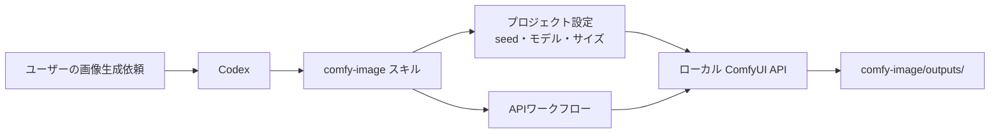

# ComfyUI × Codex

CodexからローカルのComfyUIを呼び出して画像を生成するためのプロジェクトです。Codexは画像生成依頼を、使用中のモデルとワークフローに合うプロンプトへ整理し、`comfy-image` スキルがComfyUI APIへ生成ジョブを送信します。画像の生成処理そのものはローカルComfyUIが担うため、Codexの内蔵画像生成クレジットは使いません。



```sh
git clone <repository-url> comfy-with-codex
cd comfy-with-codex
./setup.sh
```

`setup.sh` は、同梱したスキルを `~/.codex/skills/comfy-image/` へ配置し、専用ワークスペースにComfy CLIとComfyUIを導入します。大容量モデルの取得は、ライセンス確認後に `--model-url` で明示的に指定してください。

```text
.
├── skills/comfy-image/          # 配布用のCodexスキル本体
├── setup.sh                     # スキル／ComfyUIの自動セットアップ
├── setup.md                     # 詳細なセットアップ手順
├── workflows/                   # プロジェクト固有のAPI形式ワークフロー
├── comfy-image/
│   ├── comfy-image.project.json # モデル、seed、既定パラメータ
│   └── outputs/                 # 生成画像（Git管理対象外）
└── history.md                   # 構築履歴
```

プロジェクトごとにワークフロー、モデル、seed、サンプラー設定を保持できます。詳細は [setup.md](setup.md) を参照してください。
